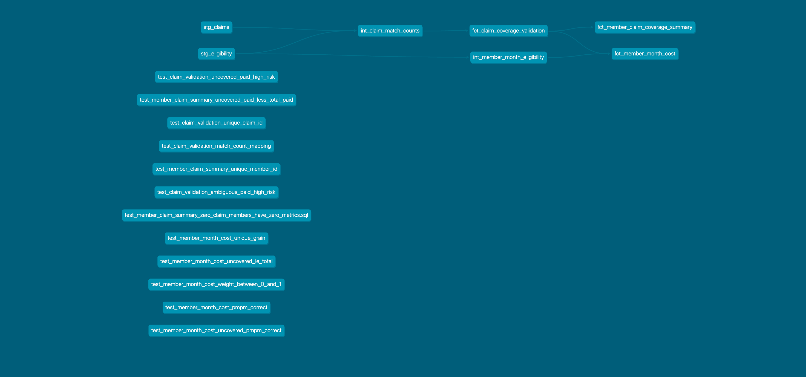

# Healthcare Claims Coverage Validation Pipeline


A production-pattern dbt pipeline that validates healthcare claims against member eligibility periods, classifies coverage risk, and produces member-month PMPM analytics. Built to demonstrate data engineering depth in healthcare data quality, temporal join logic, grain management, and automated test validation.

---

## The Problem

In healthcare insurance, claims that fall outside a member's eligibility window create billing errors, payment integrity risk, and misleading downstream analytics. Overlapping eligibility segments make claim attribution ambiguous — a single claim may match multiple eligibility rows, inflating counts and costs if not handled correctly.

This pipeline solves both problems systematically.

---

## Pipeline Architecture

```
Source Data (claims · eligibility · members)
                    │
                    ▼
        ┌─────────────────────┐
        │    STAGING LAYER    │
        │  stg_claims         │  ← clean, type, rename
        │  stg_eligibility    │  ← standardize fields
        └─────────┬───────────┘
                  │
                  ▼
        ┌─────────────────────────────────┐
        │      INTERMEDIATE LAYER         │
        │  int_claim_match_counts         │  ← temporal join, count matches
        │  int_member_month_eligibility   │  ← expand eligibility to months
        └─────────┬───────────────────────┘
                  │
                  ▼
        ┌─────────────────────────────────────────┐
        │              MART LAYER                 │
        │  fct_claim_coverage_validation          │  ← coverage + risk classification
        │  fct_member_claim_coverage_summary      │  ← member-level exposure
        │  fct_member_month_cost                  │  ← PMPM-style cost analytics
        └─────────────────────────────────────────┘
                  │
                  ▼
        ┌─────────────────────┐
        │   DATA QUALITY      │
        │   12 dbt tests      │  ← grain · business rules · formula checks
        └─────────────────────┘
```

### dbt Lineage Graph



---

## Key Engineering Logic

### 1. Temporal Join — Claims to Eligibility

Claims are matched to eligibility using date range logic:

```sql
service_date BETWEEN eligibility.effective_date AND eligibility.end_date
```

This join intentionally produces multiple rows per claim when eligibility segments overlap. The intermediate layer resolves this by counting matches and correcting grain before it reaches the mart.

### 2. Coverage Classification

Rather than arbitrarily assigning a claim to one eligibility segment, the pipeline explicitly classifies coverage status based on match count:

```sql
CASE
    WHEN match_count = 0 THEN 'UNCOVERED'
    WHEN match_count = 1 THEN 'COVERED'
    WHEN match_count > 1 THEN 'AMBIGUOUS'
END AS coverage_status
```

Ambiguous claims are surfaced as a first-class category — not hidden or arbitrarily resolved — which is the correct approach for payment integrity work.

### 3. Risk Classification

```sql
CASE
    WHEN coverage_status IN ('UNCOVERED', 'AMBIGUOUS')
     AND claim_status = 'PAID'
    THEN 'HIGH_RISK'
    ELSE 'LOW_RISK'
END AS claim_risk_level
```

Paid claims with no valid or ambiguous coverage are the highest business risk — they represent money paid out that may not be recoverable.

### 4. Member-Month Weighting

Eligibility periods are expanded into monthly rows using `generate_series()`. Partial months are prorated using:

```sql
member_month_weight = covered_days_in_month / days_in_month
```

This supports accurate PMPM (Per Member Per Month) denominators even when members enroll or disenroll mid-month — a common challenge in healthcare analytics.

---

## Data Model

| Model | Grain | Purpose |
|---|---|---|
| `stg_claims` | 1 row per claim | Staged source claims |
| `stg_eligibility` | 1 row per eligibility segment | Staged source eligibility |
| `int_claim_match_counts` | 1 row per claim | Counts eligibility matches, corrects grain |
| `int_member_month_eligibility` | 1 row per member per month per plan | Monthly eligibility denominator |
| `fct_claim_coverage_validation` | 1 row per claim | Coverage status + risk classification |
| `fct_member_claim_coverage_summary` | 1 row per member | Member-level exposure summary |
| `fct_member_month_cost` | 1 row per member per month | Monthly cost and PMPM metrics |

---

## Business Questions This Pipeline Answers

- Which claims were paid outside a valid eligibility window?
- Which claims are ambiguous due to overlapping eligibility segments?
- Which members have the highest uncovered paid exposure?
- What is the financial risk from HIGH_RISK paid claims?
- What is monthly paid cost normalized by member-month weight (PMPM)?
- How do partial-month eligibility periods affect cost denominators?

---

## Data Quality Test Suite

The pipeline includes 12 dbt singular tests covering structural integrity, business rules, and formula correctness:

| Test | What It Validates |
|---|---|
| `test_claim_validation_unique_claim_id` | No duplicate claims in the mart |
| `test_member_claim_summary_unique_member_id` | No duplicate members in summary |
| `test_member_month_cost_unique_grain` | Unique member + month combination |
| `test_claim_validation_match_count_mapping` | match_count maps correctly to coverage_status |
| `test_claim_validation_uncovered_paid_high_risk` | UNCOVERED + PAID = HIGH_RISK always |
| `test_claim_validation_ambiguous_paid_high_risk` | AMBIGUOUS + PAID = HIGH_RISK always |
| `test_member_claim_summary_uncovered_paid_less_total_paid` | Uncovered amount never exceeds total paid |
| `test_member_claim_summary_zero_claim_members_have_zero_metrics` | Members with no claims show zero metrics |
| `test_member_month_cost_weight_between_0_and_1` | Weight always between 0 and 1 |
| `test_member_month_cost_pmpm_correct` | PMPM formula verified with tolerance |
| `test_member_month_cost_uncovered_pmpm_correct` | Uncovered PMPM formula verified |
| `test_member_month_cost_uncovered_le_total` | Uncovered cost never exceeds total cost |

All 12 tests pass on every run.

---

## Key Design Decisions

**Grain correction before the mart**
The raw temporal join produces multiple rows per claim when eligibility overlaps. Rather than filtering or arbitrarily deduplicating, the intermediate layer groups back to claim grain by counting matches. This preserves the full picture — covered, uncovered, and ambiguous — without data loss.

**Ambiguous claims are a first-class category**
Most pipelines silently drop or arbitrarily assign ambiguous claims. This pipeline surfaces them explicitly so analysts and auditors can investigate rather than inherit hidden decisions.

**Member-month mart at member-month grain, not member-month-plan grain**
When a member has overlapping plan eligibility, summing weights across plans would overstate coverage. The pipeline uses `MAX(member_month_weight)` when collapsing to member-month grain to avoid inflating the denominator.

**Open-ended eligibility dates are capped**
Eligibility records with far-future end dates (e.g. `9999-12-31`) are capped during month expansion to prevent `generate_series()` from producing thousands of irrelevant rows.

---

## Running the Pipeline

### Prerequisites

```bash
# Python 3.10+
# PostgreSQL running locally on port 5433
# dbt-core and dbt-postgres installed

pip install dbt-core dbt-postgres
```

### Setup

```bash
# Clone the repo
git clone https://github.com/shalav-awale/healthcare-data-engineering-project
cd healthcare-data-engineering-project

# Verify connection
dbt debug

# Install dbt packages
dbt deps
```

### Run

```bash
# Run all models
dbt run

# Run all tests
dbt test

# Run models and tests together
dbt build

# View documentation
dbt docs generate
dbt docs serve
```

### Expected Output

```
Done. PASS=7 WARN=0 ERROR=0 SKIP=0 TOTAL=7   ← dbt run
Done. PASS=12 WARN=0 ERROR=0 SKIP=0 TOTAL=12  ← dbt test
```

---

## Technology Stack

| Tool | Purpose |
|---|---|
| dbt Core | Transformation layer — models, tests, documentation |
| PostgreSQL | Local data warehouse |
| Python | Environment and tooling |
| Git / GitHub | Version control |
| GitHub Actions | CI/CD — automated test runs on pull requests |
| VS Code | Development environment |

---

## CI/CD

A GitHub Actions workflow runs automatically on every pull request targeting `main`:

1. Installs dbt and dependencies
2. Runs `dbt compile` — validates SQL syntax
3. Runs `dbt test` — executes all 12 data quality tests
4. Blocks merge if any test fails

This ensures no broken models or failing data quality checks can reach the main branch.

---

## Future Enhancements

- Connect to cloud warehouse (AWS Redshift or Snowflake)
- Add Python ingestion layer with S3 as raw data landing zone
- Orchestrate pipeline runs with Airflow on a daily schedule
- Add provider and plan-level cost attribution once attribution logic is resolved
- Containerize with Docker for portable local development
- Replace manually seeded source tables with Python ingestion 
  layer pulling from CMS Medicare public datasets into a 
  PostgreSQL raw schema

---

## What This Project Demonstrates

This project reflects production-level data engineering practices applied to a real healthcare analytics problem:

- **Temporal join logic** — matching claims to eligibility using date ranges
- **Grain management** — detecting and correcting join explosion before it reaches the mart
- **Ambiguity handling** — surfacing ambiguous records rather than silently resolving them
- **PMPM analytics** — partial-month prorating for accurate cost denominators
- **dbt layering** — staging → intermediate → mart with explicit `ref()` dependencies
- **Data quality depth** — 12 custom SQL tests covering uniqueness, business rules, and formula correctness with tolerance
- **CI/CD integration** — automated test runs on every pull request